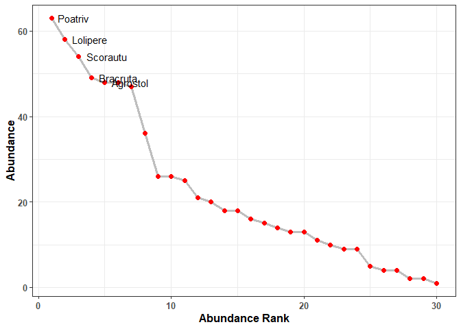

<!-- README.md is generated from README.Rmd. Please edit that file -->

# diversity.tool <a href='https://github.com/PaulESantos/diversity.tool'></a>

<!-- badges: start -->

[](https://lifecycle.r-lib.org/articles/stages.html)
[](https://CRAN.R-project.org/package=ppendemic)
[](https://travis-ci.com/PaulESantos/ppendemic)
<!-- badges: end -->

The goal of diversity.tool is to …

## Installation

You can install the development version from
[GitHub](https://github.com/) with:

``` r
# install.packages("devtools")
devtools::install_github("PaulESantos/diversity.tool")
```

## Example

This is a basic example which shows you how to solve a common problem:

-   Transform community matrix to tibble:

``` r
library(diversity.tool)
library(vegan)
data("dune")
dune_tbl <- dune %>% comm_to_tbl()
dune_tbl
#> # A tibble: 197 x 3
#>    site  species  abundance
#>    <chr> <chr>        <dbl>
#>  1 1     Achimill         1
#>  2 1     Elymrepe         4
#>  3 1     Lolipere         7
#>  4 1     Poaprat          4
#>  5 1     Poatriv          2
#>  6 2     Achimill         3
#>  7 2     Alopgeni         2
#>  8 2     Bellpere         3
#>  9 2     Bromhord         4
#> 10 2     Elymrepe         4
#> # ... with 187 more rows
```

-   Or build a community matrix from a tibble:

``` r
dune_comm <- dune_tbl %>% 
  tbl_to_comm(site, species, abundance)
dune_comm[1:6, 1:6]
#>   Achimill Elymrepe Lolipere Poaprat Poatriv Alopgeni
#> 1        1        4        7       4       2        0
#> 2        3        4        5       4       7        2
#> 3        0        4        6       5       6        7
#> 4        0        4        5       4       5        2
#> 5        2        4        2       2       6        0
#> 6        2        0        6       3       4        0
```

-   IVI index

``` r
data("bci")

bci %>% 
  ivi_index(sub_plot, species, area_basal)
#> # A tibble: 93 x 8
#> # Rowwise: 
#>    species       abundance n_splot area_basal dens_rela freq_rela dom_rela   ivi
#>    <chr>             <int>   <int>      <dbl>     <dbl>     <dbl>    <dbl> <dbl>
#>  1 Alseis.black~        25      25     29302.      4.97      5.61     5.37  5.32
#>  2 Oenocarpus.m~        22      22     25945.      4.37      4.93     4.76  4.69
#>  3 Poulsenia.ar~        24      24     18738.      4.77      5.38     3.43  4.53
#>  4 Hirtella.tri~        21      21     22910.      4.17      4.71     4.20  4.36
#>  5 Cecropia.ins~        22      12     28362.      4.37      2.69     5.20  4.09
#>  6 Virola.sebif~        17      17     18487.      3.38      3.81     3.39  3.53
#>  7 Trichilia.tu~        18      18     13994.      3.58      4.04     2.56  3.39
#>  8 Prioria.copa~        20      13     15690.      3.98      2.91     2.88  3.26
#>  9 Socratea.exo~        15      15     17793.      2.98      3.36     3.26  3.20
#> 10 Simarouba.am~        14      14     18723.      2.78      3.14     3.43  3.12
#> # ... with 83 more rows
```

-   Rank-abundance calculation:

    -   All sample units as one community

``` r
dune %>% 
  rankabund()
#> # A tibble: 30 x 7
#>    species   abun  rank proportion acumfreq logabun rel.abund
#>    <chr>    <dbl> <int>      <dbl>    <dbl>   <dbl>     <dbl>
#>  1 Poatriv     63     1       9.20     9.20    1.80    0.0920
#>  2 Lolipere    58     2       8.47    17.7     1.76    0.0847
#>  3 Scorautu    54     3       7.88    25.5     1.73    0.0788
#>  4 Bracruta    49     4       7.15    32.7     1.69    0.0715
#>  5 Agrostol    48     5       7.01    39.7     1.68    0.0701
#>  6 Poaprat     48     6       7.01    46.7     1.68    0.0701
#>  7 Trifrepe    47     7       6.86    53.6     1.67    0.0686
#>  8 Alopgeni    36     8       5.26    58.8     1.56    0.0526
#>  9 Elymrepe    26     9       3.80    62.6     1.41    0.0380
#> 10 Planlanc    26    10       3.80    66.4     1.41    0.0380
#> # ... with 20 more rows
```

-   Each sample units as a different community

``` r
dune %>% 
  rankabund(group = "site")
#> # A tibble: 197 x 8
#> # Groups:   sites [20]
#>    sites species  abundance  rank proportion acumfreq logabun rel.abund
#>    <chr> <chr>        <dbl> <int>      <dbl>    <dbl>   <dbl>     <dbl>
#>  1 1     Lolipere         7     1      38.9      38.9   0.845    0.389 
#>  2 1     Elymrepe         4     2      22.2      61.1   0.602    0.222 
#>  3 1     Poaprat          4     3      22.2      83.3   0.602    0.222 
#>  4 1     Poatriv          2     4      11.1      94.4   0.301    0.111 
#>  5 1     Achimill         1     5       5.56    100     0        0.0556
#>  6 10    Lolipere         6     1      14.0      14.0   0.778    0.140 
#>  7 10    Trifrepe         6     2      14.0      27.9   0.778    0.140 
#>  8 10    Achimill         4     3       9.30     37.2   0.602    0.0930
#>  9 10    Anthodor         4     4       9.30     46.5   0.602    0.0930
#> 10 10    Bromhord         4     5       9.30     55.8   0.602    0.0930
#> # ... with 187 more rows
```

+Rank-abundance plot

``` r
dune %>% 
  rankabund_plot()
```



## Citation

To cite the ppendemic package, please use:

``` r
citation("diversity.tool")
#> 
#> To cite package 'diversity.tool' in publications use:
#> 
#>   Paul Efren Santos Andrade (2021). diversity.tool: Tools for
#>   biodiversity data manipulation. R package version 0.0.0.1.
#> 
#> A BibTeX entry for LaTeX users is
#> 
#>   @Manual{,
#>     title = {diversity.tool: Tools for biodiversity data manipulation},
#>     author = {Paul Efren {Santos Andrade}},
#>     year = {2021},
#>     note = {R package version 0.0.0.1},
#>   }
```
